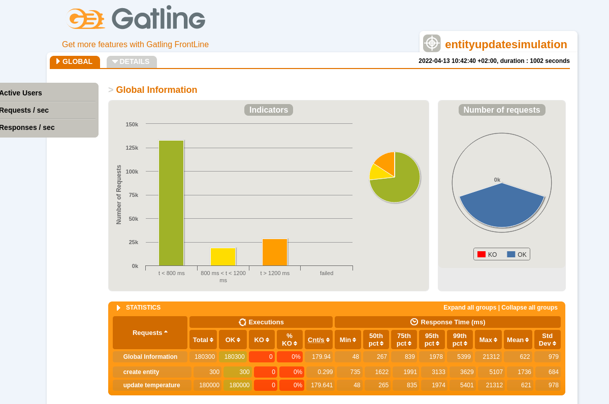

# Run tests

The test-framework supports two modes of running load tests - via maven or inside a kuberentes cluster. The description will focus on the maven version.

1. Go to the [test.conf](src/test/resources/test.conf) and set update the values to fit the test:
```
# how many entities should be simulated in parallel - gatling runs them async, resources on the local machine will have an influence.  
# For bigger scenarios, run tests via helm
numEntities=300
# URL of the ngsi-ld api 
baseUrl="https://0979971oo1.execute-api.eu-west-1.amazonaws.com/ngsi-ld/v1/"
# How many updates should be simulated? Applies to any scenario running updates:
# simulations.nosec.ld.EntityUpdateSimulation, simulations.nosec.ld.BatchUpdateSimulation, simulations.nosec.ld.EntityUpdateWithSubscriptionSimulation, simulations.nosec.ld.EntityUpdateWithTypeSubscriptionSimulation
numUpdates=300
# how many GET requests hsould be exectued? Applies to scenarios retrieving entities:
# simulations.nosec.ld.GetSingleEntitiesSimulation
numGets=30
# How many queries should be executed? Applies to querying scenarios:
# simulations.nosec.ld.QueryEntitiesByAttributeSimulation, simulations.nosec.ld.QueryEntitiesByTypeSimulation, simulations.nosec.ld.ComplexQueryEntitiesByAttributeSimulation
numQueries= 30
# How many queries should run in parallel? Applies to the same scenarios as mentioned above
parallelQueries=100
# How many seconds should be the delay between consecutive updates? Applies to any scenario running updates.
updateDelay=1
# How many entities should a single batch contain? Applies to batch scenarios:
# simulations.nosec.ld.BatchUpdateSimulation,  simulations.nosec.ld.BatchUpdateWithSubscriptionSimulation
batchSize=10
# Address of the notification receiver. This is required for all scenarios including notifications:
# simulations.nosec.ld.EntityUpdateWithSubscriptionSimulation, simulations.nosec.ld.EntityUpdateWithTypeSubscriptionSimulation
# BE AWARE: depending on the broker-implementation, the speed of the notification server might have major impact on the test results.
# assure that it is capable of handling the amount of requests.
notificationServerUrl="http://echo-server"
# How many entities should be put into the database BEFORE the tests start? should be used to simulate an already grown system and is not tracked as part of the test. 
numPrefillEntities=0
```
2. Run the tests using maven. For better analysis, its recommended to run the scenarios individually:
```shell
    mvn clean gatling:test -Dgatling.simulationClass=<SCENARIO_CLASS>
```
The available scenarios can be found in the [scala-sources](./src/test/scala/simulations/nosec/ld/) and have to be be supplied including the package, f.e.:
```shell
    mvn clean gatling:test -Dgatling.simulationClass=simulations.nosec.ld.EntityUpdateSimulation 
```

3. Analyze the results, you will find them after the run in: ./target/gatling/results/<TEST_NAME>/index.html - view them in the browser:




## Misc

### Reports

An intial set of tests and reports can be found at [testReports/aws](./testReports/aws)

### Open points
#### Default Context
There seems to be an additional default context beside the [core-context](https://uri.etsi.org/ngsi-ld/v1/ngsi-ld-core-context.jsonld) in the implementation. The context expands f.e. "open" to "https://uri.fiware.org/ns/data-models#open" on insertion,
but does not work on queries. When using q=(open==true), the result is empty even if there are fitting entities. This might make query tests faster than they would be in reality.

#### Query with only "q"
The scenario "QueryEntitiesByAttributeSimulation" cannot be executed, since Scorpio is not NGSI-LD compliant in that detail. According to the spec 6.4.3.2-1 "At least one among: type,attrs, q, or georel shall be present." for queries,
but when querying with only "q" provided, Scorpio answers:
```json
{
"type": "https://uri.etsi.org/ngsi-ld/errors/BadRequestData",
  "title": "Bad Request Data.",
  "details": "Missing mandatory minimum parameter type or attrs"
}
```
Request: 
```shell
curl --location --request GET 'https://0979971oo1.execute-api.eu-west-1.amazonaws.com/ngsi-ld/v1/entities?q=(producer==%22producer1%22)%0A'
```

